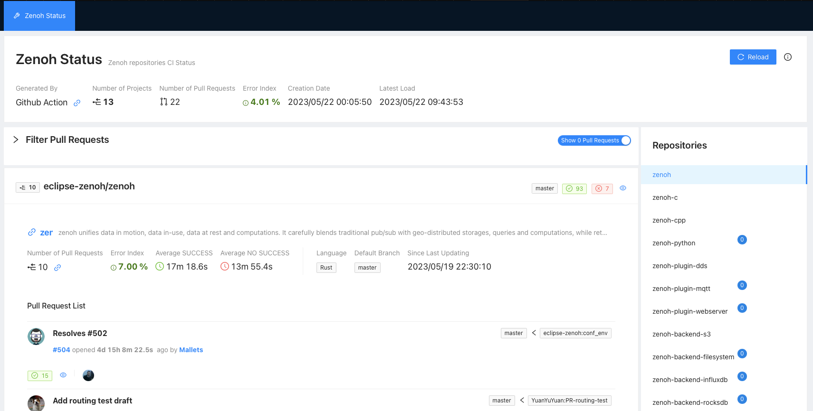

# Zenoh Status Page

This repository contains the source, assets and github workflow action for generating the Zenoh Status Page which provides real-time status updates and information about the Zenoh project currently opened pull-request.

Zenoh is an open-source, distributed data sharing and messaging system designed for edge computing, IoT, and hybrid cloud environments. The Zenoh Status Page serves as a centralized location for users and developers to monitor the pull request in a cross repository manner.

## Usage 

Navigate to [View Zenoh Status Page](https://zettascalelabs.github.io/zenoh-status-page/status/zenoh-status)
## Features

- Near Real-Time status updates on Open Pull Request 
- Centralized View on PR
- Visual indicators for Failed Checks 
- Visual indicators for Average Time
- Details view for failed checks
- Error Rate Index on n_failures/n-checks
- Responsive design for optimal viewing on different devices

## Setup 

The setup is done by using two workflow, provided in this repository :

- Status webpage generation: providing a React web application, hosted in github page [Generate status page](https://github.com/ZettaScaleLabs/zenoh-status-page/actions/workflows/generate_status_page.yml)
- Status data generation with all the information that will be displayed on the webapge Generate status page data [Generate status page data](https://github.com/ZettaScaleLabs/zenoh-status-page/actions/workflows/generate_status_data.yml)
  

## Acknowledgements

The Zenoh Status Page is deployed for eclipse-zenoh related project, and based on the following action :
- chain-status-action